# Model Predicted Control Practice For Learning

The purpose of this repository is mainly to deepen my understanding of MPC and trajectory optimization. I mainly focus on the control of the legged robot. Here, choosing automatic driving is mainly for learning. Relatively speaking, the control of the car model at low speed is relatively simple. Note: this repository mainly refers to the repository from(Thank you DhruvaKumar) [DhruvaKumar MPC](https://github.com/DhruvaKumar/model-predictive-control). Of course, I will add some contents that it did not do, and welcome to communicate this tech with me.

The repo mainly includes:
1. How to use cppad to solve differential equations.
2. How to use ipopt to solve nonlinear problems.
3. Linear and nonlinear model derivation for unmanned vehicles.
4. MPC for convex optimization QP solution based on linear model
5. MPC based on nonlinear model IPOPT solution.
6. Finally use the simulation platform to validate the results in real-time, mainly ref to [self-driving-car-sim](https://github.com/udacity/self-driving-car-sim)
7. I have to say that Unity 3D is powerful. I'll see later if I have enough time to use webots as an simulation platform to try. I think this is a good platform to replace the native emulator.

这个仓库建立的目的主要是为了记录学习笔记，记录的目的是加深我对MPC和轨迹优化理解。我本人主要专注足试机器人的控制，玩自动驾驶这个主要是为了学习，主要原因相对起来，低速情况下的车模型控制相对简单一些(三个变量，三维)。注意该仓库主要参考来自[DhruvaKumar MPC](https://github.com/DhruvaKumar/model-predictive-control). 的仓库。当然我会包括一些原仓库没有做的内容，毕竟是笔记也会更详细一些，欢迎大家和我交流和并支持我。

整个仓库包括的内主要是:
1. 如何使用cppad 解微分方程。
2. 如何使用CPPAD 中的ipopt来解非线性问题的。
3. 无人车的线性和非线性模型推导。
4. 基于线性模型的凸优化QP求解的MPC
5. 基于非线性模型IPOPT求解的MPC。
6. 最后使用来自参考仓库使用的仿真平台进行实时仿真[self-driving-car-sim](https://github.com/udacity/self-driving-car-sim)
7. 不得不说Unity 3D的强大，后面我看看如果有时间的话，用webots来做仿真平台来试试，我想这是一个好的替换原生仿真器的好平台。

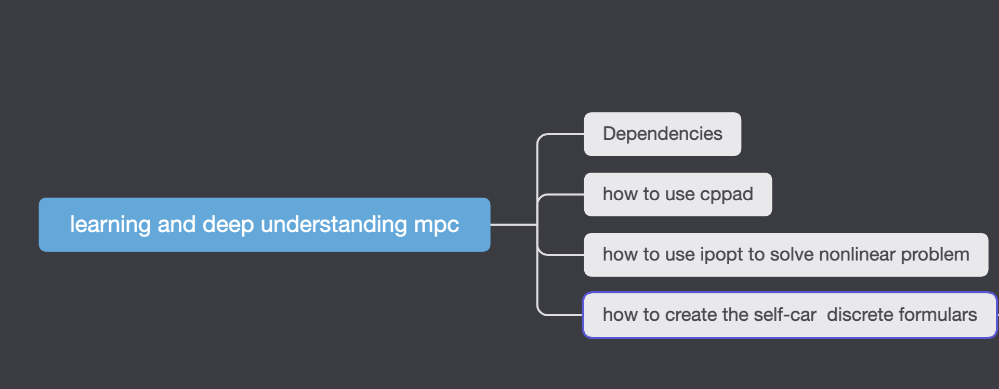

# Dependencies 

我目前使用的电脑是Mac, 这里就只给出Mac 版本下的安装方式，原仓库有ubuntu的安装方式可以去参考。
* [1] 安装[uWebSockets](https://github.com/uWebSockets/uWebSockets) 这个主要用于和Udacity官方封装好的仿真器实时通信的包。
    ```shell
    #! /bin/bash
    brew install openssl libuv cmake zlib
    git clone https://github.com/uWebSockets/uWebSockets 
    cd uWebSockets
    git checkout e94b6e1
    patch CMakeLists.txt < ../cmakepatch.txt
    mkdir build
    export PKG_CONFIG_PATH=/usr/local/opt/openssl/lib/pkgconfig 
    cd build
    OPENSSL_VERSION=`openssl version -v | cut -d' ' -f2`
    cmake -DOPENSSL_ROOT_DIR=$(brew --cellar openssl)/$OPENSSL_VERSION -DOPENSSL_LIBRARIES=$(brew --cellar openssl)/$OPENSSL_VERSION/lib ..
    make 
    sudo make install
    cd ..
    cd ..
    sudo rm -r uWebSockets
    ```
* [2] 安装ipopt,cppad 和gnuplot(for plot)
    ```shell
    brew install ipopt
    brew install cppad
    brew install gnuplot
    ```
* [3] 如果要使用python 控制的话，一定要注意版本,只有这样的版本可以通信上，但是我还是不能控制，只能收到数据(现在也没解决)。
    ```shell
    pip install python-engineio==3.8.2
    pip install python-socketio==4.2.1
    ```
* [4] 安装仿真环境[self-driving-car-sim](https://github.com/udacity/self-driving-car-sim)
直接下载term2最新版本即可，term2主要针对是控制器控制的情况,打开后，选择MPC control 可以进入如下图按键(wsad前进后退左右转)：
  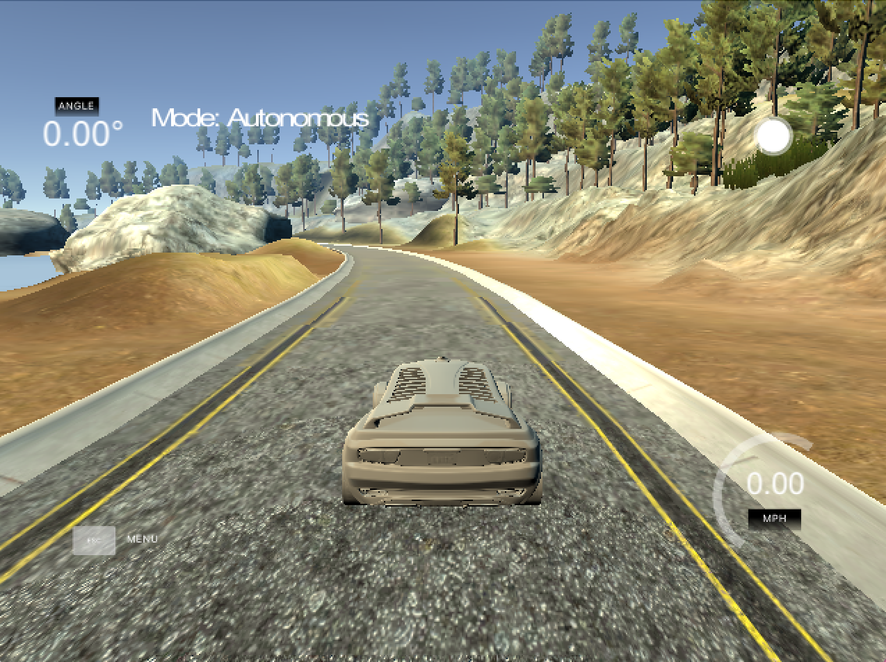

# 如何使用编译使用代码

1. Make a build directory: `mkdir build && cd build`
2. Compile: `cmake .. && make -j8`
3. Run it: `./mpc`. 这里也包括两个例子。

# 如何使用cppad?
参考官网给出的例子，这里可以直接运行,这个很简单就不细说啦。
```shell
./cppad_exp_1 1 //f(x)=1+x+x^2+x^3+x^4  at the point x=2
./cppad_exp_1 2 //f(x)=1+x+x^2/2  at the point x=.5
./cppad_exp_1 3 //f(x)=exp(x)−1−x−x2/2  at the point x=.5.
```
# 如何使用CPPAD中的非线性解释器ipopt？

# 这里使用的车模型，自行车模型，主要针对低速情况。

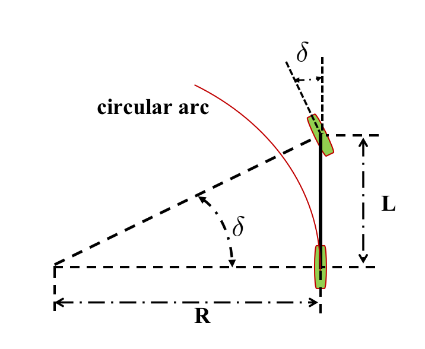
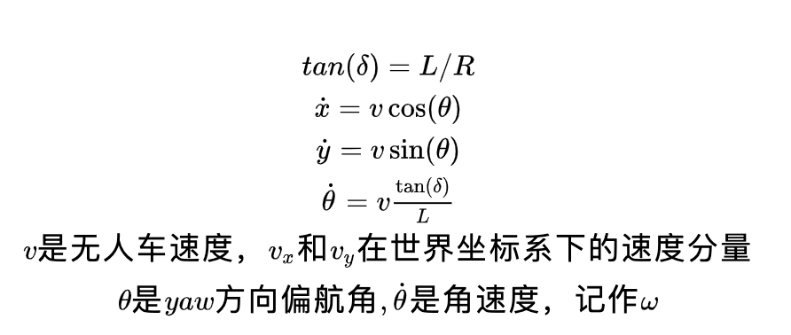
自行车模型简化了无人车前轮转向角和曲率之间的几何关系，方便建立模型，但注意该模型没有考虑高速情况下的侧滑等情况。因此如果想要在无人车上高速情况下进行更高精度的控制，这个需要建立新的动力学模型。

# 如何把无人车公式转换为线性模型，然后使用QSQP进行MPC？

## 使用泰勒级数转为线性模型
无人车使用雅克比把非线性系统转化为线性系统，当然这个线性系统只能在很小的范围内生效，这也是线性化的通病，无人车的速度主要是靠油门控制，反向主要靠方向盘，也就是可以理解为两个输入。把动力学模型写成如下公式
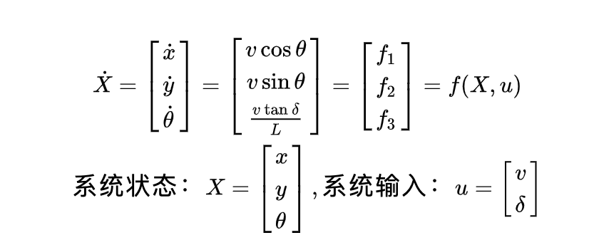
假设在运动过程中的某个s点进行雅克比(泰勒级数，省去高阶项)线性化处理得:
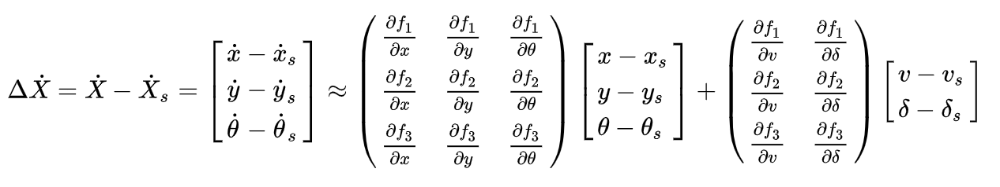
整理可以得到如下式子：
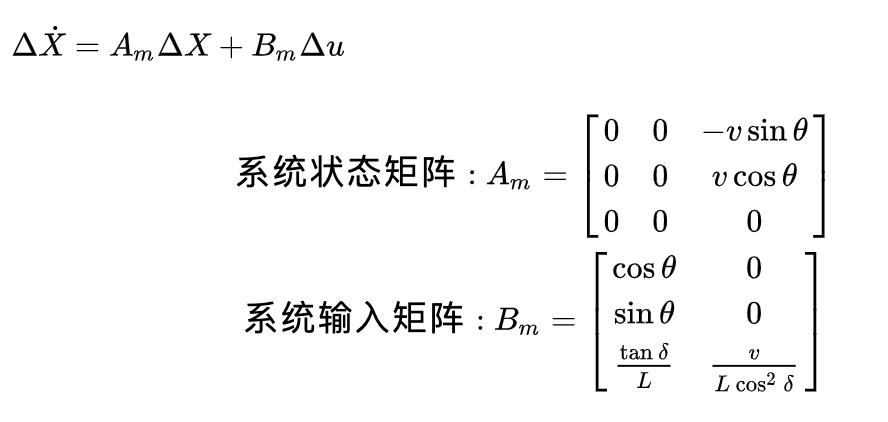
假设控制周期为Delta T,那么可以近似得到：
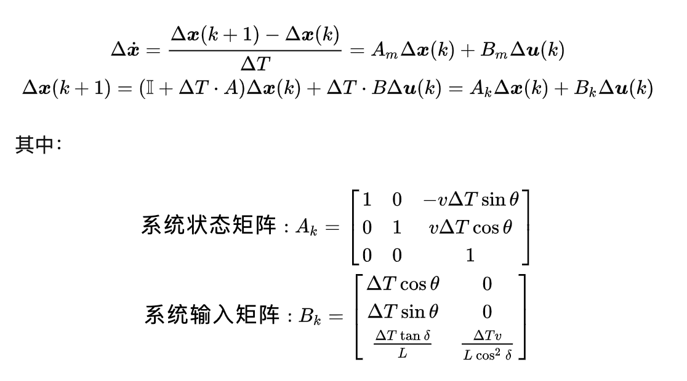
假设使用MPC来做预测未来h步，那么线性模型如下:
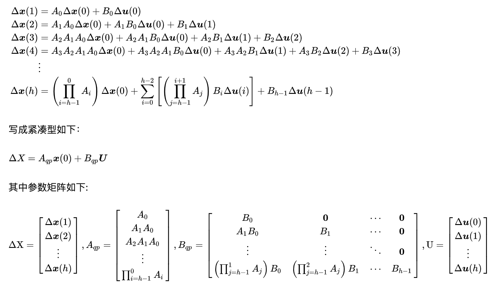
## 直接使用动力学模型进行差分离散化构建MPC方程
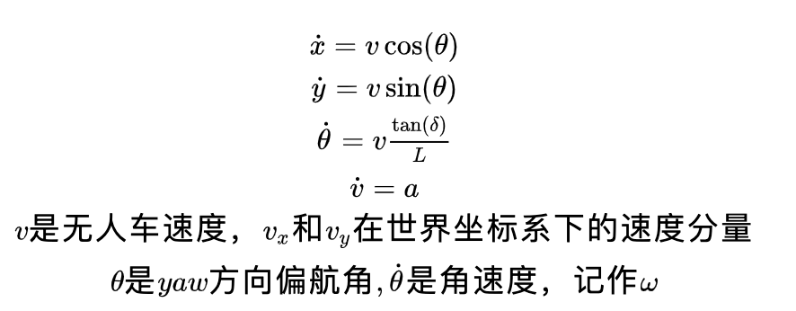
离散差分模型如下，控制周期为dt：
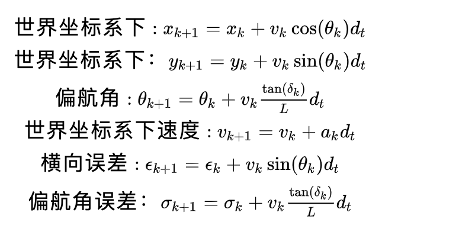
这里采用Stanley Method 进行偏航角误差和横向误差计算:
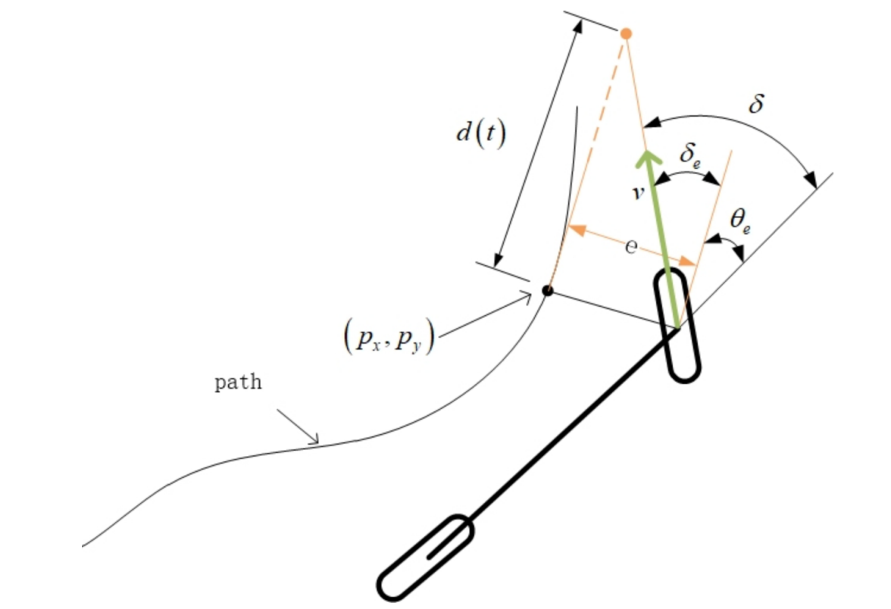
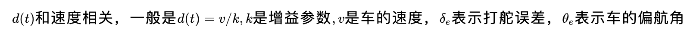
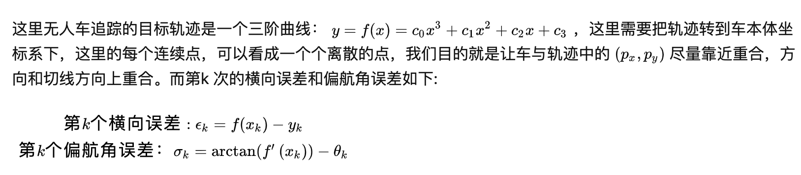
对于一个预测步长为h的MPC控制器求解问题，根据仓库所述的优化函数如下:
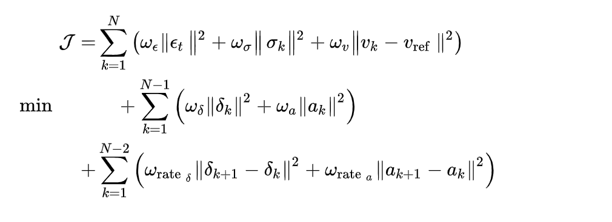
而上述优化问题需要满足的动态约束为:
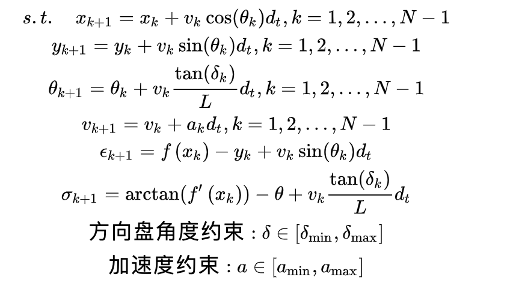
# 如何使用无人车非线性模型然后使用开源的非线性解释器ipopt进行求解？
这个部分参考代码，我把代码都注释了一遍。
# 结果展示
总体来说，MPC效果还是不错，但是会出现跳动，这个问题，需要继续深挖。
## 1. 线性模型
这个部分暂时还没做，后续更新。
## 2. 非线性模型
可以看到还是会存在抖动.


# 参考文献(Reference)
1. [self-driving-car-sim](https://github.com/udacity/self-driving-car-sim)
2. [DhruvaKumar MPC](https://github.com/DhruvaKumar/model-predictive-control)
3. [windSes Blog](https://windses.blog.csdn.net/article/details/103519721#comments_20178791)
4. [QSQP](https://osqp.org/docs/examples/index.html)
5. [Jesse_stanly_method](https://blog.csdn.net/renyushuai900/article/details/98460758)
6. [Gnuplot](http://stahlke.org/dan/gnuplot-iostream/)
7. [matplotlib_cpp](https://github.com/lava/matplotlib-cpp)